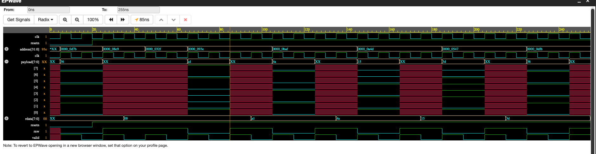

# Simple Memory UVM Testbench

This repository contains a complete, production-grade Universal Verification Methodology (UVM 1.2) testbench written in SystemVerilog. It verifies a memory module (`simple_memory`) using a modular architecture featuring race-free clocking blocks, dynamic shadow memory scoreboarding, and constrained-random/directed transaction sequences.

---

## 📌 Project Overview

The Design Under Test (DUT) is a `simple_memory` RAM module with an 8-bit data path and 32-bit addressable bus interface. The testbench generates constrained-random stimulus, drives physical signals using clocking blocks (`cb_drv`), monitors protocol timing (`cb_mon`), and validates actual DUT read data against a dynamic associative memory model.

---

## 🏗️ UVM Architecture

The environment follows standard UVM structural hierarchy, utilizing TLM analysis ports and factory overrides for maximum reusability.

| Component | File | Function |
| :--- | :--- | :--- |
| **Test** | `my_test.sv` | Top-level test orchestrator that raises/drops objections and chains stimulus sequences[cite: 8]. |
| **Environment** | `my_env.sv` | Structural container housing the Agent and Scoreboard. |
| **Agent** | `my_agent.sv` | Encapsulates the Sequencer, Driver, and Monitor components. |
| **Scoreboard** | `my_scoreboard.sv` | Self-checking golden model using an associative array (`shadow_mem[int]`) to compare expected vs. actual data[cite: 11]. |
| **Monitor** | `my_monitor.sv` | Passively samples `bus_if` via `cb_mon` on clock edges and broadcasts `packet_item` transactions[cite: 12]. |
| **Driver** | `my_driver.sv` | Pulls sequence items and drives physical interface pins on `cb_drv` using non-blocking (`<=`) assignments[cite: 10]. |
| **Interface** | `bus_if.sv` | Encapsulates protocol signals and clocking blocks (`#1step` setup, `#0` hold) to prevent race conditions. |

---

## 🚀 Stimulus Generation & Sequences

*   **`packet_item.sv`:** Base sequence item containing randomized fields (`address`, `payload`, `rnw`) constrained to valid address bounds (`address < 32'h1000`)[cite: 9].
*   **`my_sequence.sv`:** Generates constrained-random traffic to stress-test arbitrary read/write ordering and catch uninitialized reads[cite: 13].
*   **`raw_sequence.sv`:** Directed Read-After-Write (RAW) sequence that captures write addresses and immediately executes matching reads to verify data retention[cite: 14].

---

## 📊 Verification Results (Synopsys VCS Log)

The testbench was executed using **Synopsys VCS (X-2025.06-SP1)**. The simulation clean-passes at **255 ns** with **0 Errors** and **0 Fatals**.

### Key Execution Highlights
1. **Uninitialized Read Detection:** `my_sequence` issued random reads to unwritten addresses (`8e9`, `32f`), which the Scoreboard correctly flagged as non-fatal protocol warnings (`UVM_WARNING`)[cite: 11, 13].
2. **Read-After-Write (RAW) Pass:** `raw_sequence` executed back-to-back RAW checks across multiple addresses (`93e`, `baf`, `a4d`, `547`, `dfb`), all reporting `SUCCESS` in the Scoreboard[cite: 11, 14].

```text
UVM_INFO my_driver.sv(41) @ 85: uvm_test_top.env_inst.agent_inst.drv_inst [DRV] Driving a READ to Addr: 93e
UVM_INFO my_monitor.sv(52) @ 105: uvm_test_top.env_inst.agent_inst.mon_inst [MON] Monitor captured a packet! RNW:1 Address:93e
UVM_INFO my_scoreboard.sv(34) @ 105: uvm_test_top.env_inst.sb_inst [SCB] SUCCESS! DUT Simply Read and Remembered Correct rdata value of a1 at address 93e

